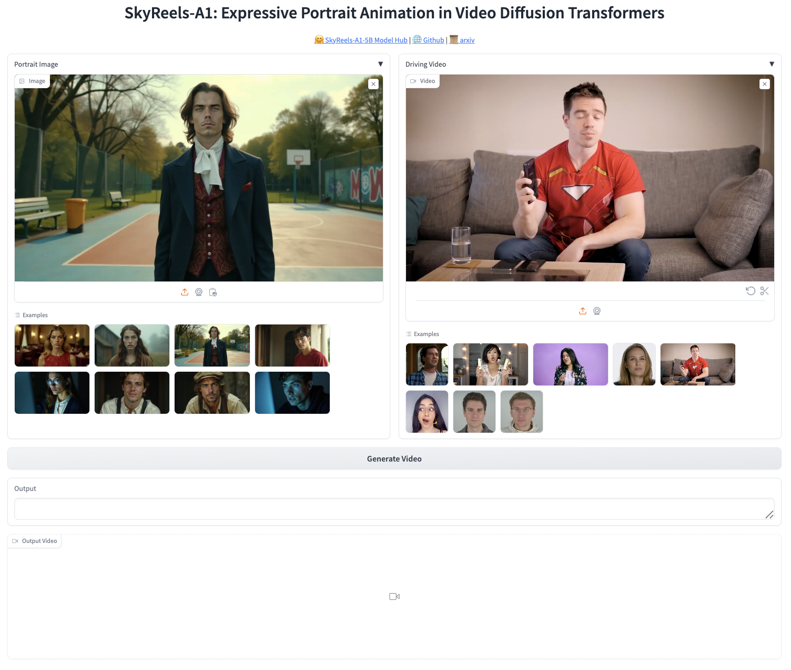

<p align="center">
  
</p>


<h1 align="center">SkyReels-A1: Expressive Portrait Animation in Video Diffusion Transformers</h1>

<div align='center'>
    <a href='https://scholar.google.com/citations?user=6D_nzucAAAAJ&hl=en' target='_blank'>Di Qiu</a>&emsp;
    <a href='https://scholar.google.com/citations?user=_43YnBcAAAAJ&hl=zh-CN' target='_blank'>Zhengcong Fei</a>&emsp;
    <a href='' target='_blank'>Rui Wang</a>&emsp;
    <a href='' target='_blank'>Jialin Bai</a>&emsp;
    <a href='https://scholar.google.com/citations?user=Hv-vj2sAAAAJ&hl=en' target='_blank'>Changqian Yu</a>&emsp;
</div>

<div align='center'>
  <a href='https://scholar.google.com.au/citations?user=ePIeVuUAAAAJ&hl=en' target='_blank'>Mingyuan Fan</a>&emsp;
  <a href='https://scholar.google.com/citations?user=HukWSw4AAAAJ&hl=en' target='_blank'>Guibin Chen</a>&emsp;
  <a href='https://scholar.google.com.tw/citations?user=RvAuMk0AAAAJ&hl=zh-CN' target='_blank'>Xiang Wen</a>&emsp;
</div>

<div align='center'>
    <small><strong>Skywork AI, Kunlun Inc.</strong></small>
</div>

<br>

<div align="center">
  <!-- <a href='LICENSE'></a> -->
  <a href='https://arxiv.org/abs/2502.10841'></a>
  <a href='https://skyworkai.github.io/skyreels-a1.github.io/'></a>
  <a href='https://huggingface.co/Skywork/SkyReels-A1'></a>
  <a href='https://www.skyreels.ai/home?utm_campaign=github_A1'></a>
  <br>
</div>
<br>


<p align="center">
  
  <br>
  🔥 For more results, visit our <a href="https://skyworkai.github.io/skyreels-a1.github.io/"><strong>homepage</strong></a> 🔥
</p>

<p align="center">
    👋 Join our <a href="https://discord.gg/PwM6NYtccQ" target="_blank"><strong>Discord</strong></a> 
</p>


This repo, named **SkyReels-A1**, contains the official PyTorch implementation of our paper [SkyReels-A1: Expressive Portrait Animation in Video Diffusion Transformers](https://arxiv.org/abs/2502.10841).


## 🔥🔥🔥 News!!
* Mar 4, 2025: 🔥 We release audio-driven portrait image animation pipeline. Try out on [Huggingface Spaces Demo](https://huggingface.co/spaces/Skywork/skyreels-a1-talking-head) !
* Feb 18, 2025: 👋 We release the inference code and model weights of SkyReels-A1. [Download](https://huggingface.co/Skywork/SkyReels-A1)
* Feb 18, 2025: 🎉 We have made our technical report available as open source. [Read](https://skyworkai.github.io/skyreels-a1.github.io/report.pdf)
* Feb 18, 2025: 🔥 Our online demo of LipSync is available on SkyReels now! Try out on [LipSync](https://www.skyreels.ai/home/tools/lip-sync?refer=navbar) .
* Feb 18, 2025: 🔥 We have open-sourced I2V video generation model [SkyReels-V1](https://github.com/SkyworkAI/SkyReels-V1). This is the first and most advanced open-source human-centric video foundation model.

## 📑 TODO List
- [x] Checkpoints
- [x] Inference Code
- [x] Web Demo (Gradio)
- [x] Audio-driven Portrait Image Animation Pipeline
- [x] Inference Code for Long Videos
- [ ] User-Level GPU Inference on RTX4090
- [ ] ComfyUI


## Getting Started 🏁 

### 1. Clone the code and prepare the environment 🛠️
First git clone the repository with code: 
```bash
git clone https://github.com/SkyworkAI/SkyReels-A1.git
cd SkyReels-A1

# create env using conda
conda create -n skyreels-a1 python=3.10
conda activate skyreels-a1
```
Then, install the remaining dependencies:
```bash
pip install -r requirements.txt
```


### 2. Download pretrained weights 📥
You can download the pretrained weights is from HuggingFace:
```bash
# !pip install -U "huggingface_hub[cli]"
huggingface-cli download Skywork/SkyReels-A1 --local-dir local_path --exclude "*.git*" "README.md" "docs"
```

The FLAME, mediapipe, and smirk models are located in the SkyReels-A1/extra_models folder.

The directory structure of our SkyReels-A1 code is formulated as: 
```text
pretrained_models
├── FLAME
├── SkyReels-A1-5B
│   ├── pose_guider
│   ├── scheduler
│   ├── tokenizer
│   ├── siglip-so400m-patch14-384
│   ├── transformer
│   ├── vae
│   └── text_encoder
├── mediapipe
└── smirk

```

#### Download DiffposeTalk assets and pretrained weights (For Audio-driven)

- We use [diffposetalk](https://github.com/DiffPoseTalk/DiffPoseTalk/tree/main) to generate flame coefficients from audio, thereby constructing motion signals.

- Download the diffposetalk code and follow its README to download the weights and related data.

- Then place them in the specified directory.

```bash
cp -r ${diffposetalk_root}/style pretrained_models/diffposetalk
cp ${diffposetalk_root}/experiments/DPT/head-SA-hubert-WM/checkpoints/iter_0110000.pt pretrained_models/diffposetalk
cp ${diffposetalk_root}/datasets/HDTF_TFHP/lmdb/stats_train.npz pretrained_models/diffposetalk
```

```text
pretrained_models
├── FLAME
├── SkyReels-A1-5B
├── mediapipe
├── diffposetalk
│   ├── style
│   ├── iter_0110000.pt
│   ├── stats_train.npz
└── smirk

```

#### Download Frame interpolation Model pretrained weights (For Long Video Inference)

- We use [FILM](https://github.com/dajes/frame-interpolation-pytorch) to generate transition frames, making the video transitions smoother (Set `use_interpolation` to True).

- Download [film_net_fp16.pt](https://github.com/dajes/frame-interpolation-pytorch/releases), and place it in the specified directory.

```text
pretrained_models
├── FLAME
├── SkyReels-A1-5B
├── mediapipe
├── diffposetalk
├── film_net
│   ├── film_net_fp16.pt
└── smirk
```


### 3. Inference 🚀
You can simply run the inference scripts as: 
```bash
python inference.py

# inference audio to video
python inference_audio.py
```

If the script runs successfully, you will get an output mp4 file. This file includes the following results: driving video, input image or video, and generated result.

#### Long Video Inference

Now, you can run the long video inference scripts to obtain portrait animation of any length：
```bash
python inference_long_video.py

# inference audio to video
python inference_audio_long_video.py
```


## Gradio Interface 🤗

We provide a [Gradio](https://huggingface.co/docs/hub/spaces-sdks-gradio) interface for a better experience, just run by:

```bash
python app.py
```

The graphical interactive interface is shown as below: 




## Metric Evaluation 👓

We also provide all scripts for automatically calculating the metrics, including SimFace, FID, and L1 distance between expression and motion, reported in the paper.  

All codes can be found in the ```eval``` folder. After setting the video result path, run the following commands in sequence: 

```bash
python arc_score.py
python expression_score.py
python pose_score.py
```


## Acknowledgements 💐
We would like to thank the contributors of [CogvideoX](https://github.com/THUDM/CogVideo), [finetrainers](https://github.com/a-r-r-o-w/finetrainers) and [DiffPoseTalk](https://github.com/DiffPoseTalk/DiffPoseTalk)repositories, for their open research and contributions. 

## Citation 💖
If you find SkyReels-A1 useful for your research, welcome to 🌟 this repo and cite our work using the following BibTeX:
```bibtex
@article{qiu2025skyreels,
  title={SkyReels-A1: Expressive Portrait Animation in Video Diffusion Transformers},
  author={Qiu, Di and Fei, Zhengcong and Wang, Rui and Bai, Jialin and Yu, Changqian and Fan, Mingyuan and Chen, Guibin and Wen, Xiang},
  journal={arXiv preprint arXiv:2502.10841},
  year={2025}
}
```


