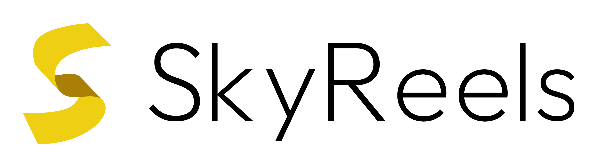

<p align="center">
  
</p>


<h1 align="center">SkyReels-A1: Expressive Portrait Animation in Video Diffusion Transformers</h1>
<div align='center'>
    <a href='https://scholar.google.com/citations?user=6D_nzucAAAAJ&hl=en' target='_blank'><strong>Di Qiu</strong></a>&emsp;
    <a href='https://scholar.google.com/citations?user=_43YnBcAAAAJ&hl=zh-CN' target='_blank'><strong>Zhengcong Fei</strong></a>&emsp;
    <a target='_blank'><strong>Rui Wang</strong></a>&emsp;
    <a target='_blank'><strong>Jialin Bai</strong></a>&emsp;
    <a href='https://scholar.google.com/citations?user=Hv-vj2sAAAAJ&hl=en' target='_blank'><strong>Changqian Yu</strong></a>&emsp;
</div>

<div align='center'>
  <a href='https://scholar.google.com.au/citations?user=ePIeVuUAAAAJ&hl=en' target='_blank'><strong>Mingyuan Fan</strong></a>&emsp;
  <a href='https://scholar.google.com/citations?user=HukWSw4AAAAJ&hl=en' target='_blank'><strong>Guibin Chen</strong></a>&emsp;
  <a href='https://scholar.google.com.tw/citations?user=RvAuMk0AAAAJ&hl=zh-CN' target='_blank'><strong>Xiang Wen</strong></a>&emsp;
</div>

<div align='center'>
    <small>Skywork AI </small>
</div>

<br>

<div align="center">
  <!-- <a href='LICENSE'></a> -->
  <a href='https://arxiv.org/abs/2502.10841'></a>
  <a href='https://skyworkai.github.io/skyreels-a1.github.io/'></a>
  <a href='https://huggingface.co/Skywork/SkyReels-A1'></a>
  <a href='https://www.skyreels.ai/home'></a>
  <br>
</div>
<br>


<p align="center">
  
  <br>
  🔥 For more results, visit our <a href="https://skyworkai.github.io/skyreels-a1.github.io/"><strong>homepage</strong></a> 🔥
</p>


This repo, named **SkyReels-A1**, contains the official PyTorch implementation of our paper [SkyReels-A1: Expressive Portrait Animation in Video Diffusion Transformers](https://arxiv.org).


## 🔥🔥🔥 News!!
* Feb 18, 2025: 👋 We release the inference code and model weights of SkyReels-A1. [Download](https://huggingface.co/Skywork/SkyReels-A1)
* Feb 18, 2025: 🎉 We have made our technical report available as open source. [Read](https://skyworkai.github.io/skyreels-a1.github.io/report.pdf)


## Getting Started 🏁 

### 1. Clone the code and prepare the environment 🛠️
First git clone the repository with code: 
```bash
git clone https://github.com/SkyworkAI/SkyReels-A1.git
cd SkyReels-A1

# create env using conda
conda create -n skyreels-a1 python=3.10
conda activate skyreels-a1
```
Then, install the remaining dependencies:
```bash
pip install -r requirements.txt
```


### 2. Download pretrained weights 📥
You can download the pretrained weights is from HuggingFace:
```bash
# !pip install -U "huggingface_hub[cli]"
huggingface-cli download SkyReels-A1 --local-dir local_path --exclude "*.git*" "README.md" "docs"
```

The directory structure of our SkyReels-A1 code is formulated as: 
```text
pretrained_weights
├── FLAME
├── SkyReels-A1-5B
│   ├── pose_guider
│   ├── scheduler
│   ├── tokenizer
│   ├── siglip-so400m-patch14-384
│   ├── transformer
│   ├── vae
│   └── text_encoder
├── mediapipe
└── smirk

```


### 3. Inference 🚀
You can simply run the inference scripts as: 
```bash
python inference.py
```

If the script runs successfully, you will get an output mp4 file. This file includes the following results: driving video, input image or video, and generated result.


## Gradio Interface 🤗

We provide a [Gradio](https://huggingface.co/docs/hub/spaces-sdks-gradio) interface for a better experience, just run by:

```bash
python app.py
```

The graphical interactive interface is shown as below: 


## Metric Evaluation 👓

We also provide all scripts for automatically calculating the metrics, including SimFace, FID, and L1 distance between expression and motion, reported in the paper.  

All codes can be found in the ```eval``` folder. After setting the video result path, run the following commands in sequence: 

```bash
python arc_score.py
python expression_score.py
python pose_score.py
```


## Acknowledgements 💐
We would like to thank the contributors of [CogvideoX](https://github.com/THUDM/CogVideo) and [finetrainers](https://github.com/a-r-r-o-w/finetrainers) repositories, for their open research and contributions. 

## Citation 💖
If you find SkyReels-A1 useful for your research, welcome to 🌟 this repo and cite our work using the following BibTeX:
```bibtex
@misc{qiu2025skyreelsa1expressiveportraitanimation,
      title={SkyReels-A1: Expressive Portrait Animation in Video Diffusion Transformers}, 
      author={Di Qiu and Zhengcong Fei and Rui Wang and Jialin Bai and Changqian Yu and Mingyuan Fan and Guibin Chen and Xiang Wen},
      year={2025},
      eprint={2502.10841},
      archivePrefix={arXiv},
      primaryClass={cs.CV},
      url={https://arxiv.org/abs/2502.10841}, 
}
```


